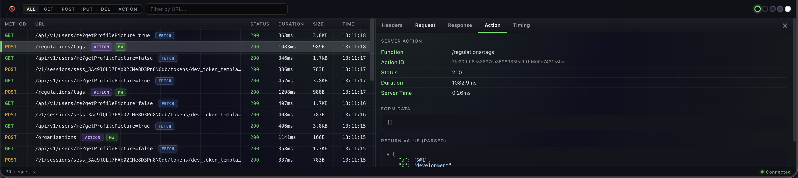
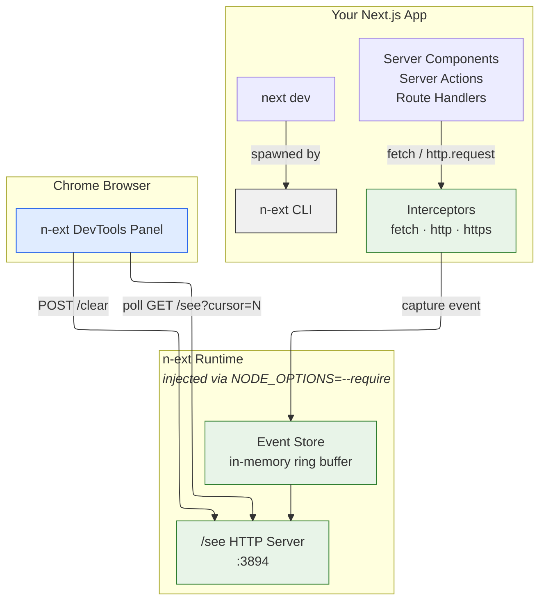

# 🔍 n-ext

[](https://github.com/chaiops/n-ext/releases/latest)
[](LICENSE)

Next.js Server DevTools — capture and inspect server-side network requests (fetch & http) from your Next.js app in a Chrome DevTools panel.

> ⚠️ **Development only.** n-ext is designed exclusively for local development. It does not ship to production, adds zero runtime overhead to production builds, and refuses to start if `NODE_ENV=production`. Think of it like React DevTools — a transparent layer that exists only while you're building.

<p align="center">
  
</p>

## 🚀 Getting started

Just replace `next` with `n-ext` in your dev command — that's it, you get a full network inspector for Next.js.

### 1. Run

```bash
npx @chaiops/n-ext dev
```

Or install as a dev dependency:

```bash
npm install @chaiops/n-ext --save-dev
# or
pnpm add -D @chaiops/n-ext
```

### 2. Update your dev script

```json
{
  "scripts": {
    "dev": "n-ext dev"
  }
}
```

All arguments are forwarded to `next dev`:

```json
{
  "scripts": {
    "dev": "n-ext dev --port 3099 --turbopack"
  }
}
```

### 3. Install the Chrome extension

1. Download [`n-ext-chrome-v0.0.4-alpha.zip`](https://github.com/chaiops/n-ext/releases/download/ext-v0.0.4-alpha/n-ext-chrome-v0.0.4-alpha.zip) or grab the latest from [GitHub Releases](https://github.com/chaiops/n-ext/releases/latest)
2. Unzip the downloaded file
3. Open `chrome://extensions` and enable **Developer mode**
4. Click **Load unpacked** and select the unzipped folder
5. Open DevTools on your app — you'll see a **🍵 NExt** tab

### 4. Run your app

```bash
npm run dev
```

You should see:

```
[n-ext] DevTools server running at http://127.0.0.1:3894/see
[n-ext] Interceptors installed (server mode)
```

Open your app in Chrome, open DevTools, and switch to the **🍵 NExt** tab to see captured server-side requests.

## ✨ Features

| Feature | Details |
|---|---|
| **Automatic interception** | Captures `fetch`, `http.request`, and `https.request` — no code changes needed |
| **Chrome DevTools panel** | Dedicated **🍵 NExt** tab with request list, headers, body preview, and timing |
| **JSON tree preview** | Collapsible JSON viewer for request and response bodies |
| **Method & URL filtering** | Filter by HTTP method (GET, POST, PUT, DELETE) and URL pattern |
| **Request details** | View request/response headers, bodies, status codes, duration, and size |
| **Copy to clipboard** | One-click copy for request and response bodies (auto-formatted JSON) |
| **Copy as cURL** | Export any captured request as a ready-to-run cURL command |
| **JWT token parser** | Automatically decodes Bearer tokens and displays the JWT payload in a dedicated Auth tab |
| **Server Actions logger** | Captures Next.js server action calls with action ID, form data, and return values in a dedicated Action tab |
| **Middleware detection** | Labels requests that passed through Next.js middleware with a `mw` badge and shows middleware headers |
| **Cursor-based polling** | Efficient incremental updates — only fetches new events |
| **Ring buffer storage** | Keeps the last 1000 events in memory with zero disk I/O |
| **Development only** | Refuses to start if `NODE_ENV=production` — zero production impact |
| **Zero config** | No middleware, no config files — just replace `next` with `n-ext` |
| **Local only** | Listens on `127.0.0.1:3894` — never exposed to the network |
| **Dual source tracking** | Labels each request as `fetch` or `http` so you know the origin |

## 🔮 Future Scope

- **MCP server** — Expose captured requests via Model Context Protocol so AI tools (Cursor, Claude Code) can read and reason about your server's network traffic
- **CLI viewer** — Terminal-based UI for inspecting requests without opening Chrome (`n-ext --tui`)

## 💡 Why

Next.js server components, server actions, and route handlers make API calls that are **invisible** to the browser's Network tab. You're left with a few options, none of them great:

| Approach | Problem |
|---|---|
| **Node.js debugger** | You're juggling two separate debugger windows (browser + Node) and it lacks the filtering/visualization of Chrome DevTools |
| **`console.log`** | You have to litter your code with logging statements and clean them up later |
| **`process.env.NODE_ENV` / `isDevelopment` guards** | You're changing application code just to get dev-only observability |

All of these share the same fundamental issue: **they require you to modify your application code** to see what your server is doing.

What we actually want is a **transparent dev-only layer** — something that captures every server-side fetch and http call automatically, without touching your application code, and shows it right in Chrome DevTools. Like React DevTools, but for your server's network traffic.

`n-ext` does exactly that. Replace `next dev` with `n-ext dev` and you get a Chrome DevTools panel showing every outgoing request your server makes — method, URL, status, headers, body, timing — with **zero code changes** and **zero production impact**.

## 🏗️ Architecture



**Data flow:**

1. **`n-ext dev`** spawns `next dev` with `NODE_OPTIONS=--require register.js`, injecting interceptors into the Node.js process before any app code runs
2. **Interceptors** monkey-patch `globalThis.fetch`, `http.request`, and `https.request` — every outgoing request is captured with method, URL, headers, body, status, timing, and size
3. **Event Store** holds the last 1000 events in a ring buffer with monotonic cursors for efficient polling
4. **`/see` server** (port 3894) serves events as JSON — the Chrome extension polls `GET /see?cursor=N` every 500ms to get only new events
5. **Chrome DevTools panel** renders a network-inspector UI with filtering, detail views, and timing visualization

## ⚙️ How it works

`n-ext` wraps `next dev` and injects runtime interceptors via `NODE_OPTIONS=--require`. It patches `globalThis.fetch`, `http.request`, and `https.request` to capture all outgoing server-side requests. Captured events are exposed on `http://localhost:3894/see` for the Chrome extension to consume.

**Key design decisions:**

- 🚫 **No production code** — the CLI exits immediately if `NODE_ENV=production`
- 🧩 **No app changes needed** — interception happens at the runtime level via `--require`
- 🔒 **Listens on `127.0.0.1` only** — never exposed to the network
- 🪶 **Minimal footprint** — a single `--require` flag, no middleware, no config files

## ✅ Verify it works

```bash
# Check the event stream directly
curl http://localhost:3894/see

# With cursor-based pagination
curl http://localhost:3894/see?cursor=5
```

Response format:

```json
{
  "cursor": 10,
  "events": [
    {
      "id": "uuid",
      "url": "https://api.example.com/data",
      "method": "GET",
      "status": 200,
      "duration": 123.4,
      "source": "fetch",
      ...
    }
  ]
}
```

## 📁 Monorepo structure

```
packages/
  n-ext/          CLI + runtime interceptors + /see server
  extension/      Chrome DevTools extension
apps/
  demo/           Example Next.js app
```

## 🛠️ Development

```bash
pnpm install
pnpm build                # build n-ext package
cd apps/demo && pnpm dev  # run demo with n-ext
```

### Code style

- **EditorConfig** — consistent indentation and encoding across editors (see `.editorconfig`)
- **Prettier** — auto-format with `pnpm format`; config in `.prettierrc`
- **ESLint** — lint with `pnpm lint`
- **TypeScript** — strict mode enabled in `packages/n-ext`

### Commit conventions

We use [Conventional Commits](https://www.conventionalcommits.org/):

```
<type>(<scope>): <description>

feat(interceptor): add websocket support
fix(store): prevent cursor overflow on large event counts
docs(readme): add architecture diagram
chore(deps): bump tsup to v9
refactor(panel): extract header rendering logic
```

**Types:** `feat` · `fix` · `docs` · `chore` · `refactor` · `test` · `perf` · `ci`

**Scopes (optional):** `cli` · `interceptor` · `store` · `server` · `panel` · `extension` · `deps`

### Best practices

- Keep changes focused — one concern per commit
- Run `pnpm build` before committing to make sure everything compiles
- Test with the demo app (`apps/demo`) before submitting changes
- Don't commit `dist/` — it's gitignored and built in CI

## 🤝 Contributing

Contributions are welcome! Here's how to get started:

1. **Fork** the repo and clone your fork
2. **Install** dependencies: `pnpm install`
3. **Link locally** to test in a Next.js app:
   ```bash
   cd packages/n-ext && pnpm build
   # In your Next.js app
   pnpm add -D /path/to/n-ext/packages/n-ext
   ```
   This adds a `file:` dependency. After any changes, rebuild and reinstall:
   ```bash
   cd /path/to/n-ext/packages/n-ext && pnpm build
   cd /path/to/your-app && pnpm install
   ```
4. **Create a branch** from `main`:
   ```bash
   git checkout -b feat/my-feature
   ```
5. **Make your changes** — follow the code style and commit conventions above
6. **Build & test** locally:
   ```bash
   pnpm build
   cd apps/demo && pnpm dev
   # Open Chrome DevTools → n-ext tab and verify your changes
   ```
7. **Push** and open a pull request against `main`

### PR guidelines

- Keep PRs small and focused
- Describe *what* changed and *why* in the PR description
- Link any related issues
- Make sure the build passes (`pnpm build`)

### Building & publishing packages

**n-ext (npm package):**
```bash
cd packages/n-ext
pnpm build                # compiles TypeScript to dist/
npm publish --access public  # publish to npm as @chaiops/n-ext
```

**Chrome extension:**
```bash
cd packages/extension
pnpm build                # builds to dist/ (includes README)
```
Then load the `dist/` folder in `chrome://extensions` with **Developer mode** enabled → **Load unpacked**.

**Build all packages:**
```bash
pnpm build:all
```

> **Note:** Bump the version in the relevant `package.json` (and `manifest.json` for the extension) before publishing.

## 👥 Contributors

<!-- ALL-CONTRIBUTORS-LIST:START -->
<a href="https://github.com/MananDesai54"></a>
<a href="https://github.com/anuj-kosambi"></a>
<a href="https://github.com/centerseat"></a>
<!-- ALL-CONTRIBUTORS-LIST:END -->

Built with ❤️ in India 🇮🇳

## 📄 License

[MIT](LICENSE)
