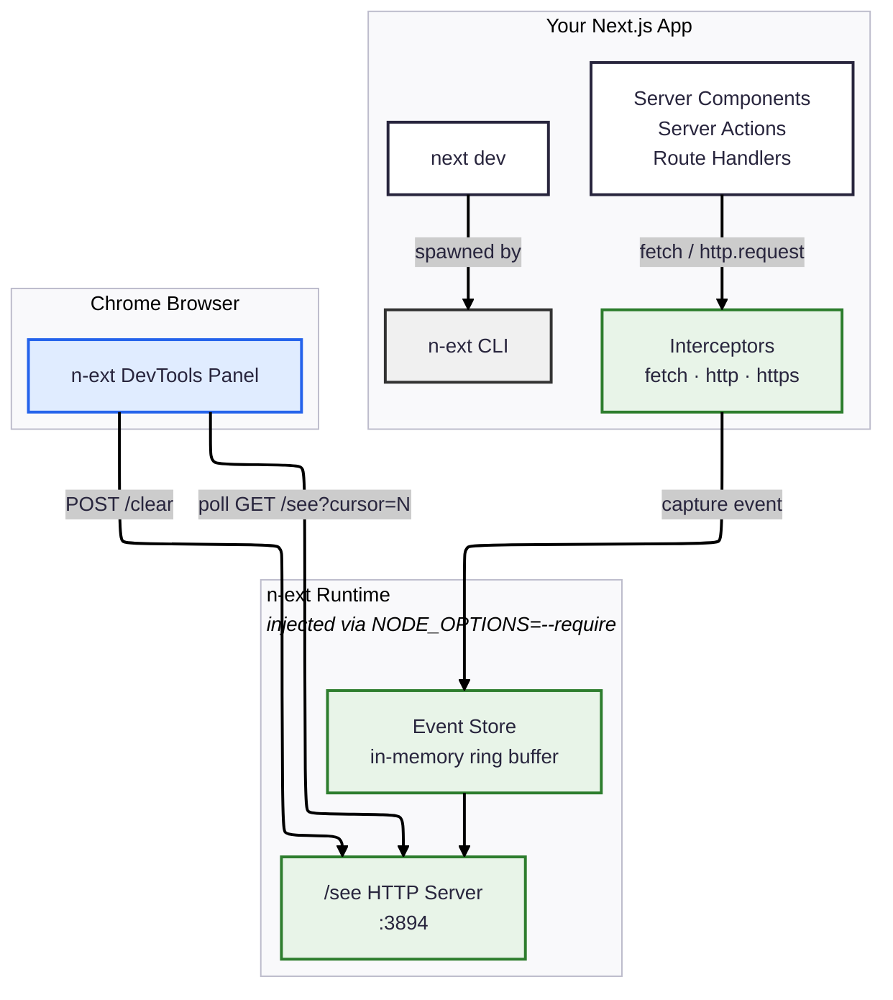

# n-ext

Next.js Server DevTools — capture and inspect server-side network requests (fetch & http) from your Next.js app in a Chrome DevTools panel.

## Why

Next.js server components, server actions, and route handlers make API calls that are invisible to the browser's Network tab. You're left with a few options, none of them great:

- **Node.js debugger** — works, but now you're juggling two separate debugger windows (browser + Node), and it lacks the filtering/visualization you get from Chrome DevTools
- **`console.log`** — adds visibility, but you have to litter your code with logging statements and clean them up later
- **`process.env.NODE_ENV` / `isDevelopment` guards** — same problem, you're changing application code to get dev-only observability

What we actually want is a **transparent dev-only layer** — something that captures every server-side fetch and http call automatically, without touching your application code, and shows it right in Chrome DevTools. Like React DevTools, but for your server's network traffic.

`n-ext` does exactly that. Replace `next dev` with `n-ext dev` and you get a Chrome DevTools panel showing every outgoing request your server makes — method, URL, status, headers, body, timing — with zero code changes and zero production impact.

## How it works

`n-ext` wraps `next dev` and injects runtime interceptors via `NODE_OPTIONS=--require`. It patches `globalThis.fetch`, `http.request`, and `https.request` to capture all outgoing server-side requests. Captured events are exposed on `http://localhost:3894/see` for the Chrome extension to consume.

## Architecture



**Data flow:**

1. **`n-ext dev`** spawns `next dev` with `NODE_OPTIONS=--require register.js`, injecting interceptors into the Node.js process before any app code runs
2. **Interceptors** monkey-patch `globalThis.fetch`, `http.request`, and `https.request` — every outgoing request is captured with method, URL, headers, body, status, timing, and size
3. **Event Store** holds the last 1000 events in a ring buffer with monotonic cursors for efficient polling
4. **`/see` server** (port 3894) serves events as JSON — the Chrome extension polls `GET /see?cursor=N` every 500ms to get only new events
5. **Chrome DevTools panel** renders a network-inspector UI with filtering, detail views, and timing visualization

## Add to an existing Next.js app

### 1. Install

```bash
npm install n-ext --save-dev
# or
pnpm add -D n-ext
```

#### Local install (without publishing)

If you're working from a local clone of this repo, build first then link:

```bash
# In the n-ext repo
cd packages/n-ext
pnpm build

# In your Next.js app
pnpm add -D /path/to/n-ext/packages/n-ext
```

This adds a `file:` dependency in your `package.json`:

```json
{
  "devDependencies": {
    "n-ext": "file:/path/to/n-ext/packages/n-ext"
  }
}
```

After any changes to `packages/n-ext`, rebuild and reinstall:

```bash
cd /path/to/n-ext/packages/n-ext && pnpm build
cd /path/to/your-app && pnpm install
```

### 2. Update your dev script

```json
{
  "scripts": {
    "dev": "n-ext dev"
  }
}
```

All arguments are forwarded to `next dev`:

```json
{
  "scripts": {
    "dev": "n-ext dev --port 3099 --turbopack"
  }
}
```

### 3. Install the Chrome extension

1. Open `chrome://extensions`
2. Enable "Developer mode"
3. Click "Load unpacked" and select the `packages/extension` directory
4. Open DevTools on your app — you'll see an **n-ext** panel

### 4. Run your app

```bash
npm run dev
```

You should see:

```
[n-ext] DevTools server running at http://127.0.0.1:3894/see
[n-ext] Interceptors installed (server mode)
```

Open your app in Chrome, open DevTools, and switch to the **n-ext** tab to see captured server-side requests.

## Verify it works

```bash
# Check the event stream directly
curl http://localhost:3894/see

# With cursor-based pagination
curl http://localhost:3894/see?cursor=5
```

Response format:

```json
{
  "cursor": 10,
  "events": [
    {
      "id": "uuid",
      "url": "https://api.example.com/data",
      "method": "GET",
      "status": 200,
      "duration": 123.4,
      "source": "fetch",
      ...
    }
  ]
}
```

## Monorepo structure

```
packages/
  n-ext/          CLI + runtime interceptors + /see server
  extension/      Chrome DevTools extension
apps/
  demo/           Example Next.js app
```

## Development

```bash
pnpm install
pnpm build                # build n-ext package
cd apps/demo && pnpm dev  # run demo with n-ext
```
